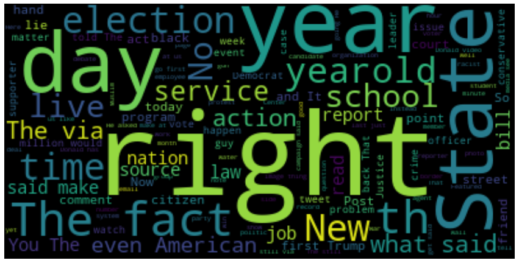
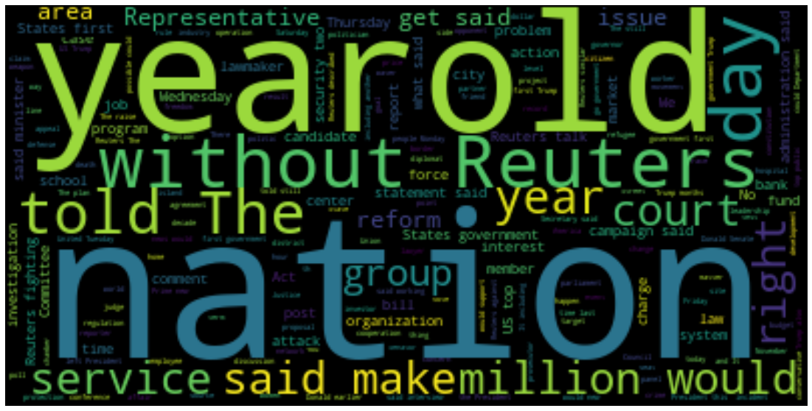
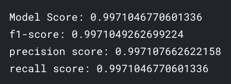
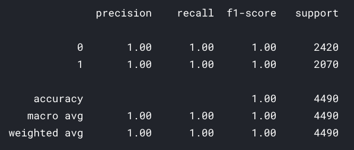
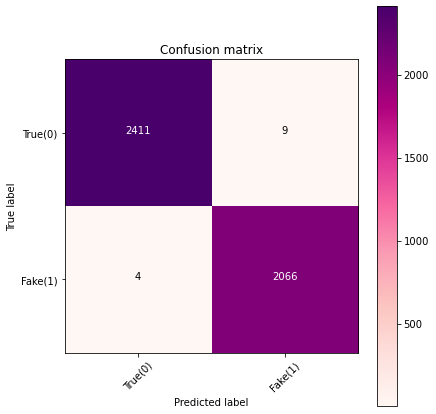

# classify-news-as-real-or-fake

## Table of contents

- [Getting started](#getting-started)
- [EDA and Model performance](#eda-and-model-performance)
- [License](#license)

## Getting started

The [notebook](https://www.kaggle.com/akashsdas/classify-news-as-real-or-fake) is available on Kaggle to work in the same environment where this notebook was created i.e. use the same version packages used, etc...

## EDA and Model performance

**Word clouds**

**Model's performance**

## License

[APACHE LICENSE, VERSION 2.0](./LICENSE)
